# iris-sys-recs-2026

Rails app + infrastructure stack (NGINX load balancer, MySQL, shared NFS storage, Prometheus/Grafana monitoring, Loki logs, and automated backups) packaged via Docker Compose.

## Quickstart

### Prerequisites

- Docker
- Ruby + Rails + Bundler (only needed to generate encrypted credentials / `config/master.key` the first time)

### 1. Create Rails encrypted credentials

This repo intentionally does **not** commit `config/master.key`. The container build uses the master key as a Docker secret.

Run this once on your host:

```bash
rm -f config/credentials.yml.enc config/master.key && bundle install && rails credentials:edit
```

### 2. Build and start everything

```bash
docker compose up --build
```

### 3. Open the app and Grafana

- App: <http://app.localhost>
- Grafana: <http://grafana.localhost>
  - HTTP Basic Auth: `admin` / `admin`
  - Grafana login: `admin` / `admin`

Only port `80` is published to your host; everything else is internal to the Compose networks.

## Overview

This project has implemented all tasks specified, including the bonus tasks:

- Three dockerised Rails application containers
- NGINX serving as a reverse proxy and load balancer to the Rails applications and Grafana
- MySQL database container
- Grafana for monitoring with a pre-configured dashboard
- Prometheus for metrics collection from Rails `/metrics`, cAdvisor, node-exporter, mysqld-exporter, and the nginx exporter
- Loki + Promtail for centralised container log aggregation
- GitHub Actions workflow to publish the app's docker image to Docker Hub at `vidowal449/iris-sys-recs-2026` whenever a new release is created
- A backup container that periodically creates backups of the MySQL database, the application code and the NFS volume, storing them under `./backups/` on the host

## What’s running (services)

- `web`, `web1`, `web2`: Rails replicas (production mode)
- `nginx`: reverse proxy + load balancer (`least_conn`) + rate limiting
- `db`: MySQL 8
- `nfs`: in-stack NFS server backing shared Rails storage
- `migrate`: one-shot `rails db:prepare` job that runs before the web replicas start
- Observability: `prometheus`, `grafana`, `loki`, `promtail`, `cadvisor`, `node-exporter`, `mysqld-exporter`, `nginx-prometheus-exporter`
- `backup`: Python daemon that snapshots DB, code, and NFS



## Implementation details

### Dockerfile

The Dockerfile uses a multi-stage build:

- Build stage installs gems and precompiles assets (requires the Rails master key as a build secret).
- Runtime stage runs as a non-root `rails` user and mounts NFS storage at container startup.

At runtime, `docker-entrypoint.sh` reads the master key from the Docker secret at `/run/secrets/rails_master_key` and exports it as `RAILS_MASTER_KEY`.

### Docker Entrypoint

The `docker-entrypoint.sh` script is responsible for:

1. Mounting the NFS volume at `/app/storage` to ensure shared file storage across web replicas.
2. Exporting the `RAILS_MASTER_KEY` environment variable from the Docker secret, making it available to the Rails application at runtime.
3. Cleaning up stale PID files.
4. Changing the ownership of the app directories to the `rails` user to ensure proper permissions.
5. Stepping down from `su` and running the app as PID 1 using `gosu`.

### Docker Compose

The `docker-compose.yml` file defines the services for the Rails application, NGINX, MySQL database, Prometheus, Loki, Promtail, Grafana, and the backup container. It sets up the necessary environment variables, volumes, and network configurations for each service. The Rails application is configured to connect to the MySQL database using environment variables for the database host, username, password, and name. NGINX is set up to listen on port 80 and forward requests to the Rails application containers. Prometheus is configured to scrape metrics from the specified exporters, Promtail discovers Docker containers and ships logs to Loki, and Grafana is provisioned with both Prometheus and Loki datasources.

### nginx and Load Balancing

nginx is configured to load balance incoming requests across the three Rails application containers using `least_conn` load balancing method, which directs traffic to the server with the least number of active connections. A rate limit has also been implemented to allow a maximum of 10 requests per second with a burst of 20 requests, and any requests exceeding this limit will receive a 429 status code.

### Persistence

The MySQL database uses a Docker volume (`db_data`) to ensure data persistence across container restarts. The DB used is the production database. NGINX, Prometheus, and Grafana configuration files are mounted from the repository, making the setup reproducible. The backup container writes to `/backups` which is bind-mounted to `./backups/` in this repo on the host, ensuring backup artifacts persist across container recreation. Prometheus data is also stored in a Docker volume (`prometheus_data`) to ensure that metrics data is retained across container restarts. The app file data is served through the in-stack NFS server (`nfs`) and persisted by the NFS export volume (`nfs_server_data`); each web replica mounts NFS at container startup via `docker-entrypoint.sh`, which keeps `docker compose up` as a single startup command while preserving shared cross-replica file storage.

Backups are written into the repo’s `./backups/` directory on the host (via the Compose bind mount `./backups:/backups`):

- `backups/db/*.sql`
- `backups/code/*.tar.xz`
- `backups/nfs/*.tar.xz`

### Monitoring

Prometheus scrapes:

- Rails `/metrics` endpoint from all three web replicas
- `cAdvisor` (container metrics)
- `node-exporter` (host metrics)
- `mysqld-exporter` (MySQL metrics)
- `nginx-prometheus-exporter` (NGINX stub_status)

Loki receives logs from Promtail, which discovers Docker containers through the Docker socket. Loki can be accessed using Grafana's Explore feature to query logs with LogQL.

Grafana is set up to use both Prometheus and Loki as datasources. It is provisioned with four dashboards to visualise metrics:

1. Docker Container
2. MySQL
3. NGINX
4. Rails App

For the rails app metrics, I have instrumented the app with `prometheus-client` and added custom metrics for total HTTP requests, HTTP request duration, and DB query duration. These metrics are exposed at the `/metrics` endpoint, which Prometheus scrapes every 15 seconds.

### Backup

A python backup script acting as a daemon periodically creates backups of the MySQL database, selected application code directories, and the shared NFS storage. The container writes to `/backups` which is bind-mounted to `./backups/` in this repo on the host. For all backup categories (`db`, `code`, and `nfs`), it computes SHA256 hashes and only keeps a backup when its content is unique. Code and NFS backups are compressed using `tar.xz` compression. The backup container is configured to run every hour (3600 seconds) and uses a count-based retention policy that keeps the latest 5 timestamped backups per category, automatically deleting older backups.

### GitHub Actions

A GitHub Actions workflow is set up to publish the app's docker image to Docker Hub at `vidowal449/iris-sys-recs-2026`, whenever a new release is created. It also caches the Docker layers to speed up the build process for subsequent releases.

## Issues faced (but resolved) and design decisions

One of the challenges I faced was ensuring that the NFS volume was properly mounted and shared across all web replicas. Initially, I tried to mount the NFS volume directly in the `docker-compose.yml` file, but this approach did not work as it entered a race condition. This was due to Docker mounting the NFS volume before the NFS server container was fully up and running. It is also not possible (AFAIK) to have the NFS volume be healthy before mounting it. I had originally thought of making it such that the launch command would include a delay in it (such as, `... && sleep 10 && ...`) to give the NFS server time to start, but this felt hacky and unreliable. Instead, I moved the NFS mount logic into the `docker-entrypoint.sh` script of the web containers. This way, the web containers will attempt to mount the NFS volume at startup, and if the NFS server is not ready yet, it will simply fail to mount and retry on the next container restart. This approach proved to be more robust and reliable, ensuring that the NFS volume is properly mounted and shared across all web replicas.

Another one was removing fixing an issue early on with volumes not mounting as Docker couldn't find it because of platform differences (Linux vs Mac). I had to ensure that it was `host.docker.internal` and not `127.0.0.1`, Although, I have moved to to an entrypoint script as mentioned above.

I have also not exposed Prometheus UI externally as it is redundant given that Grafana can be used to query Prometheus metrics. Exposing Prometheus UI externally could potentially allow unauthorised users to access sensitive metrics data.
